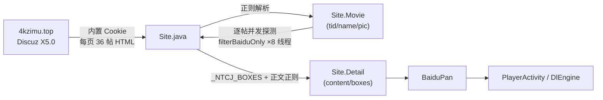
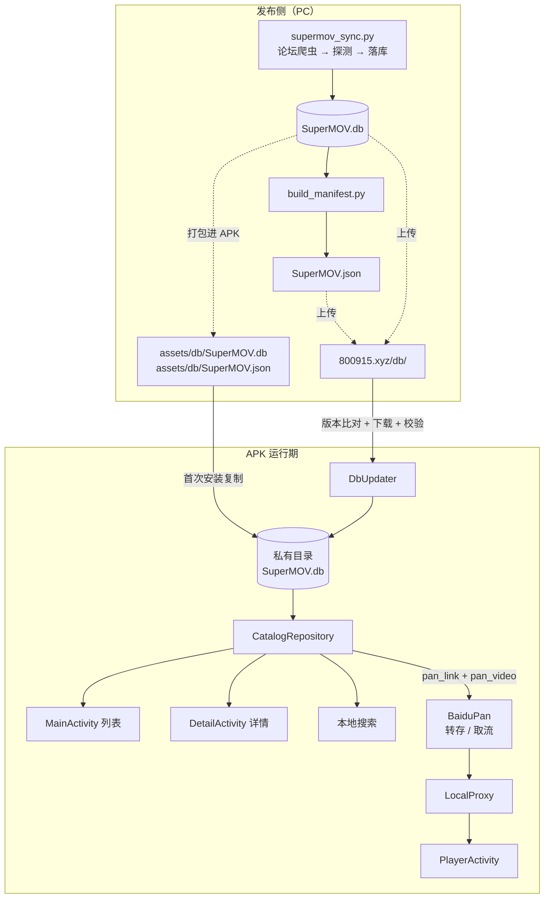
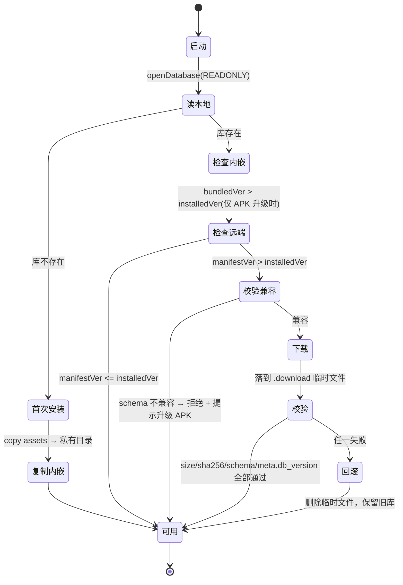

# DJYDXS3Nexio 数据库重构方案

> 分支：`GamePCStudio/DJYDXS-TV` → `DJYDXS3Nexio`
> 包名 `com.supermov.tv`　应用名 DJYDXS TV　当前 versionCode 27
> 数据源变更：**4kzimu.top 论坛（cookie 实时抓取） → SuperMOV.db（本地 SQLite）**
> 本文档为施工蓝图，覆盖数据层、更新机制、网盘清单利用、代码清洗与分阶段任务。

---

## 0. 结论先行

| 问题 | 结论 |
|---|---|
| 1. 内容来源改为本地库 | 可以，且**播放链路一行都不用改**。`BaiduPan` / `LocalProxy` / `PlayerActivity` / `DlEngine` 全部与来源解耦——它们只吃"片名 + 百度分享链接"，而这两样 DB 里都有。要改的只有"列表/详情/搜索"这三处取数入口。 |
| 2. 库内嵌 APK + 在线更新 | **必须做 `SuperMOV.json`**，否则每次检查更新都得把 1.9 MB 整包拉一遍。清单 ~1 KB，用版本号比对即可决定要不要下载。完整机制见 §5。 |
| 3. 未来库结构会变（如暂无"电影名称"） | 必须引入**适配层**，不能让 UI 直接读表。今天用"`◎译 名` → 《》 → `cleanTitle`"三级回退，能 100% 解析出干净片名（已实测 326/326）；未来库里补了 `name_cn` 就优先用它。见 §4.4。 |
| 4. 网盘里 mkv/mp4 已直接列出 | 这是**本次重构最大的红利**。2525 个文件清单直接躺在 `pan_video`，可以做到：详情页**零网络请求**秒出剧集列表、转存后精确校验缺集、下载前预知总容量。见 §6。 |
| 5. 论坛代码清洗 | `Site.java`（1007 行）整文件删除，其中 4 个纯文本工具方法移植到新类保留；`WebLoginActivity` 连manifest 一起删；内置论坛 Cookie 删除（顺带消除凭据硬编码问题）。完整清单见 §7。 |

---

## 1. 现状盘点

### 1.1 当前数据流



### 1.2 痛点（这是要重构的根本原因）

| # | 问题 | 量级 |
|---|---|---|
| P1 | **首屏要探测 36 个帖子**：每个帖子一个 `thread-xxx.html`（约 130 KB），一页 ≈ 4.7 MB、36 次请求 | 首次进版块约 5 秒 |
| P2 | **论坛 Cookie 会过期**：失效后整站空白，要靠"设置→论坛登录"人工救 | 内置 Cookie 已硬编码在 `Site.DEFAULT_FORUM_COOKIE` |
| P3 | **论坛页结构随时可变**：已在代码里堆了 3 套兼容（`byg_*` 新版海报墙 / `haibao-*` 旧版卡片 / 表格布局兜底） | `Site.java` 里 20+ 条正则 |
| P4 | **"有没有百度盘"必须联网才知道**：探测逻辑 + `BAIDU_PROBE` 内存缓存 | 切版块反复探测 |
| P5 | **拿不到文件清单**：详情页只给分享链接，要知道里面几集、多大、哪一集，必须转存后用 `api/list` 逐层扫（`MAX_DEPTH=5` / `MAX_FILES=300`） | 1107 集的分享会被截断 |
| P6 | 论坛凭据硬编码进 APK | 安全/合规问题 |

### 1.3 目标数据流



**关键变化**：`Site.java` 的位置被 `CatalogRepository` + `SuperMovDb` 取代；`BaiduPan` 及其下游完全不动。

---

## 2. 数据库契约（现状事实）

已实测当前 `SuperMOV.db`（1.89 MB，`meta.schema_version = 1`）：

| 表 | 行数 | 用途 | 关键列 |
|---|---|---|---|
| `movie` | 326 | 影片主表，一条 = 一个论坛帖 | `src_tid`(UNIQUE)、`title`、`pic`、`content`、`runtime`、`classification`、`fid`、`forum_name`、`pan_status`、`pan_url`、`pan_pwd`、`video_count`、`total_size` |
| `pan_link` | 499（**327 条 `status='ok'`**） | 百度盘链接 + 探测结论 | `src_tid`、`movie_id`、`url`、`pwd`、`status`、**`shareid`**、**`share_uk`**、`video_count` |
| `pan_video` | 2525 | **网盘内 mkv/mp4 全量清单** | `pan_link_id`、`src_tid`、`path`、`filename`、`ext`、`size`、`season`、`episode` |
| `reject` | 163 | 被过滤影片（人工复查用） | `src_tid`、`reason`、`detail` |
| `sync_run` | 6 | 同步运行日志 | — |
| `meta` | 1 | 元信息 | `schema_version` |

### 2.1 实测确认的重要事实

1. **`movie.pan_status` 全部 = `'ok'`**（326/326）。也就是说：DB 里**只存在有百度盘的影片**。
   → 原 `Site.filterBaiduOnly()` / `probeAndFill()` / `BAIDU_PROBE` 这一整套**整体作废**，首页不再需要任何"探测"。
2. **`pan_link.status='ok'` 的 327 条链接，`video_count` 全部 > 0**。
   → 不会出现"链接有效但没视频"的坑。
3. **`movie.title` 是论坛原始标题，带技术垃圾**，不能直接当片名用：
   ```
   《飞驰人生3》4K高码版.Pegasus.3.2026.2160p.HQ.WEB-DL.H265.DTS 15.4G
   极度深寒[满屏版].Deep.Rising.1998.Open.Matte.WEB-DL.1080p.x264.AAC-TYZH.德加拉国语，英语.mkv
   ```
4. **`movie.content` 是纯文本、但被压成了一整行**（无 `\n`）。样例：
   ```
   ◎译 名 金谍行动/金劫任务(台)/Operation Debt Collectors ◎片 名 In the Grey ◎年 代 2026
   ◎产 地 英国 ◎类 别 剧情/动作 ◎语 言 英语 ◎上映日期 2026-05-15(美国) ◎IMDb评分 …
   ```
   → **任何字段抽取都不能以换行当终止符，必须以"下一个 `◎` 标记"或串尾为界。**这是本次最容易踩的坑，见 §4.4.2。
5. `content` 已被来源截断在 600 字符，长简介会腰斩（`◎简 介` 之后内容可能不全）。
6. **`pan_link.url` 里已经带了 `?pwd=`**，且 `pwd` 列有独立值——解析时两者都要容忍。
7. **`pan_video` 没有 `fs_id`**。要"不转存直接播分享"，`fs_id` 是必需的，见 §6.3。
8. `pan_video.season` / `episode` 有 1049 行有值、1476 行为 NULL（不规范命名的猜不出来）。**不能依赖它们排序**，要用自然序排序兜底。
9. 一部片可能有**多条**有效链接。例：`src_tid=28628`（海贼王）有两条——1107 集（590 GB）与 68 集（84 GB）。`movie.pan_url` 指向视频最多的那条。
10. `movie.runtime` 有 52 行为空；`pic` / `content` / `title` 均无空值。

---

## 3. 目标工程结构

```
app/src/main/
├── assets/db/
│   ├── SuperMOV.db                 ← 内嵌基线库（构建时从 C:\py\SuperMOVDB 拷入）
│   └── SuperMOV.json               ← 内嵌清单（离线也知道自己是什么版本）
├── java/com/supermov/tv/
│   ├── db/                         ← ★ 新增：数据层
│   │   ├── SuperMovDb.java             打开只读库、schema 探测、列存在性缓存
│   │   ├── CatalogItem.java            归一化后的展示模型（UI 唯一契约）
│   │   ├── CatalogRepository.java      列表 / 详情 / 搜索 / 视频清单查询
│   │   ├── NameResolver.java           片名与元数据解析（含多级回退）
│   │   ├── DbManifest.java             SuperMOV.json 模型 + 解析
│   │   └── DbUpdater.java              内嵌复制 / 远端比对 / 下载校验 / 原子换库
│   ├── ContentFormatter.java       ← 从 Site.java 移植的正文排版工具
│   ├── MovieAdapter.java           ← 数据源换 CatalogItem
│   ├── MainActivity.java           ← 取数改为本地查询，删分页/探测
│   ├── DetailActivity.java         ← 取数改为本地查询 + pan_video 剧集列表
│   ├── SettingsActivity.java       ← 诊断项换成"库版本/清单可达性"
│   └── …（BaiduPan / LocalProxy / PlayerActivity / DlEngine 不动）
└── （删除）java/com/supermov/tv/Site.java
└── （删除）java/com/supermov/tv/WebLoginActivity.java
```

---

## 4. 数据层设计

### 4.1 只读打开

不做 Room、不做 `SQLiteOpenHelper.onCreate`——库是**外部产出物**，App 只读。

```java
// SuperMovDb.java 核心
public static SQLiteDatabase open(File f) {
    return SQLiteDatabase.openDatabase(
            f.getAbsolutePath(), null,
            SQLiteDatabase.OPEN_READONLY | SQLiteDatabase.NO_LOCALIZED_COLLATORS);
}
```

- 只读打开带来一个额外好处：**换库不需要关连接以外的清理**（无 journal 回写风险）。
- 换库时先 `db.close()` 再 `rename`，否则 Windows 侧（模拟器）会锁文件。
- `NO_LOCALIZED_COLLATORS` 避免建 `android_metadata` 表——库是只读的，写不进去会抛异常。

### 4.2 列存在性探测（应对未来结构变化的第一道闸）

```java
/** 用 PRAGMA table_info 判断某列是否存在，结果缓存。绝不硬写 SELECT 不存在的列。 */
public boolean hasColumn(String table, String col);
public boolean hasTable(String name);
public boolean hasView(String name);
```

**硬规则：所有 SELECT 都必须经过列存在性检查后再拼 SQL。** 这样"未来库里删了某列"只会让某个字段降级为空，而不是整页崩溃。列集合在库打开时一次性快照进 `Set<String>`，之后走内存。

### 4.3 展示模型 `CatalogItem`（UI 唯一契约）

UI 层**永不接触 Cursor**。所有查询返回 `CatalogItem`：

| 字段 | 来源（按优先级） | 说明 |
|---|---|---|
| `id` | `movie.id` | 主键 |
| `srcTid` | `movie.src_tid` | 稳定业务键，用于播放历史/转存记录 |
| `name` | 见 §4.4 | **干净片名**（列表标题、网盘匹配都用它） |
| `nameAlt` | `◎片 名` 或 `译名` 里的非中文段 | 副标题用 |
| `year` | `◎年 代` → 标题尾部年份 | |
| `genre` | `◎类 别` | |
| `region` | `◎产 地` | |
| `language` | `◎语 言` | 首选音轨参考 |
| `runtime` | `movie.runtime` → `◎片 长` | |
| `pic` | `movie.pic` | |
| `classification` | `movie.classification` | 分类维度（取代原 fid 列表） |
| `forumName` | `movie.forum_name` | |
| `contentRaw` | `movie.content` | 详情页排版用 |
| `panUrl` / `panPwd` | `movie.pan_url` / `pan_pwd` | 首选链接 |
| `panStatus` | `movie.pan_status` | 理论上恒为 ok |
| `videoCount` / `totalSize` | `movie.video_count` / `total_size` | 角标"共 N 集 / x GB" |
| `isRestricted` / `isErotic` | 同名列 | 过滤用，见 §4.6 |
| `remarks` | `lastpost_date` 或 `post_date` | 角标日期（原 `Site.Movie.remarks` 语义） |

### 4.4 片名与元数据解析（应对"没有直接电影名称"）

#### 4.4.1 回退链（已实测 326/326 全部解析成功）

```
① movie.name_cn / name          （未来 schema 补齐后优先，今天不存在）
② v_catalog.movie_name          （未来 sync 侧提供的视图，见 §4.5）
③ title 里的《…》                316 部命中且全部是中文名 —— 最可靠的单点信号
④ ◎译 名 里第一个含中文的段       316 部命中（含与 ③ 重叠）
⑤ ◎片 名 里第一个含中文的段       6 部只有片名时兜底
⑥ cleanTitle(title)             4 部无资料块时兜底
⑦ title 原文
```

实测结果：`译名 316 / 仅片名 6 / 仅标题 4`，**空名 0 条**。

#### 4.4.2 ★ 必须避开的解析坑（实测证据）

| 坑 | 现象 | 正确做法 |
|---|---|---|
| **content 无换行** | `◎译 名 金谍行动/… ◎片 名 In the Grey ◎年 代 2026` 全在一行 | 正则用 `◎\s*译\s*名\s*([^◎]*)`，以**下一个 `◎`** 为界；绝不用 `[^\n]+` |
| **译名/片名可能被发帖人写反** | id=18：`◎译 名 Pegasus 3 ◎片 名 飞驰人生3`（译名竟是英文） | 不认字段名认**内容**：从两个字段各自的 `/` 分段里挑"含 CJK 的段"，优先取译名的 CJK 段，其次片名的 CJK 段 |
| **别名用 / 分隔** | `◎译 名 金谍行动/金劫任务(台)/Operation Debt Collectors` | 取第一个 CJK 段作为主名，其余留作 `nameAlt` 备选 |
| **《》里可能带序号** | `《阿凡达3：火与烬》` vs `◎译 名 阿凡达：火与烬` | 两者都可接受；显示选 ③，网盘匹配时做归一化（见下） |
| **全角冒号 / 全角空格** | `◎译 名`、`◎译　名`、`◎译名：` | 正则统一 `◎\s*译[\s\u3000]*名\s*[:：]?` |

#### 4.4.3 网盘匹配必须归一化

`BaiduPan.resolveAll(rootDir, keyword)` 用片名在用户网盘里找文件夹。片名与文件夹名往往不完全一致，所以匹配前统一归一化——现成的 `BaiduPan.normName()`（只留字母数字并小写）已经做了这件事，**继续用它**，但传入的 keyword 换成 `CatalogItem.name`（干净片名），而不是原来的脏标题。这是本次重构对播放成功率最直接的一处提升。

#### 4.4.4 建议把解析下沉到发布侧（可选但推荐）

App 侧的解析是为了兼容"老库"。真正干净的方案是让 `supermov_sync.py` 在落库时算好，存成列 + 视图（schema 2）：

```sql
ALTER TABLE movie ADD COLUMN name_cn    TEXT;   -- ◎译 名 / 《》 里的中文主名
ALTER TABLE movie ADD COLUMN name_orig  TEXT;   -- ◎片 名
ALTER TABLE movie ADD COLUMN year       INTEGER;
ALTER TABLE movie ADD COLUMN genre      TEXT;
ALTER TABLE movie ADD COLUMN region     TEXT;
ALTER TABLE movie ADD COLUMN language   TEXT;
ALTER TABLE movie ADD COLUMN playable   INTEGER NOT NULL DEFAULT 1;  -- 汇总过滤位

-- 稳定视图：App 优先查它；Future 加列只要改视图，App 一行不动
CREATE VIEW v_catalog AS
SELECT m.id, m.src_tid, m.fid, m.classification, m.forum_name,
       COALESCE(m.name_cn, m.title)          AS movie_name,
       m.name_orig, m.year, m.genre, m.region, m.language,
       m.title AS raw_title, m.pic, m.content, m.runtime,
       COALESCE(m.runtime, m.year)           AS _rt,   -- 占位，实际由 sync 补
       COALESCE(m.lastpost_date, m.post_date) AS badge_date,
       m.pan_status, m.pan_url, m.pan_pwd,
       m.video_count, m.total_size, m.playable
FROM movie m
WHERE m.pan_status = 'ok';
```

**App 的取数顺序：`v_catalog` 存在 → 查视图；不存在 → 走 `movie` + §4.4.1 回退链。**这样 schema 演进对 App 是无感的。

### 4.5 schema 版本协商（防未知结构崩溃）

```java
static final int APP_SUPPORTED_SCHEMA_MAX = 2;   // 本 APK 能理解的上限
```

- 远端清单 `db.schema_version > APP_SUPPORTED_SCHEMA_MAX`
  → **拒绝更新**，保留旧库，提示"数据格式已升级，请更新 App"。
- 远端清单 `schema_version < 本地已装版本`
  → 视为回退，忽略。
- 本地库打开时 `PRAGMA user_version` / `meta.schema_version` 读不到
  → 按 schema 1 处理（最小可用集），并在设置页显示"数据格式未识别"。

**原则：宁可少显示字段，绝不崩溃。**

### 4.6 分类与过滤维度（取代硬编码 fid）

原 `Site.CATS` 硬编码了 4 个版块 + 几十个 typeid。现在直接从库里派生：

```sql
-- 一级："分类"（原版块）
SELECT classification, COUNT(*) FROM movie WHERE pan_status='ok'
GROUP BY classification ORDER BY COUNT(*) DESC;

-- 二级："版块名"（更细）
SELECT forum_name, COUNT(*) FROM movie WHERE pan_status='ok'
GROUP BY forum_name ORDER BY COUNT(*) DESC;
```

当前实际分布：`1080P最新剧集 98 / 4KSDR.Remux 89 / 1080P高码版 76 / 最新1080P电影 57 / 转载资源区 4 / 1080P.Remux 2`。

- 原"过滤器行"（typeid）**没有 DB 对应物**，直接去掉；改由"关键词 + 年份 + 类别"本地筛选替代（见 §8 阶段 3）。
- `is_restricted` / `is_erotic` 按原策略默认过滤（DB 里目前无命中）。
- 建议加一个 `playable` 汇总列，避免播放侧每次算（见 §4.4.4）。

---

## 5. 数据库更新机制

### 5.1 三层版本号

| 层 | 位置 | 作用 |
|---|---|---|
| **schema_version** | `meta.schema_version`（列结构版本） | 决定 App 能不能读懂。语义变更时 +1 |
| **db_version** | `meta.db_version`（**内容版本**） | 整数，单调递增，形如 `YYYYMMDDnn`（如 `2026091901`）。内容更新即 +1 |
| **APK versionCode** | gradle | 只用于"换包时是否重查内嵌库" |

> 当前库还没有 `db_version`，需要 sync 侧补写。补写前 App 用 `MAX(movie.updated_at)` 折算兜底。

### 5.2 为什么必须有 SuperMOV.json

否则每次"检查更新"都要 GET 整个 1.9 MB（未来库会长到几十 MB、几百 MB）：

| 无清单 | 有清单 |
|---|---|
| 拉全包 → 算 hash → 才发现没变 | GET 1 KB → 比版本号 → 相同就结束 |
| 电视盒子上一次检查 ≈ 几 MB 流量 + 十几秒 | ≈ 1 KB + 200 ms |
| 无法表达"schema 不兼容" | `compat` 字段可直接拒绝 |

### 5.3 SuperMOV.json 完整示例（由当前真实库生成）

```json
{
  "manifest_version": 1,
  "name": "SuperMOV",
  "generated_at": "2026-09-19T06:22:35+08:00",
  "db": {
    "url": "https://800915.xyz/db/SuperMOV.db",
    "version": 2026091901,
    "schema_version": 1,
    "size": 1982464,
    "sha256": "f863597dbbb9228d09457a733180392b7e8b9969881f9f46389b198b549cda9d",
    "built_at": "2026-09-19 01:45:58",
    "encoding": "utf-8"
  },
  "stats": {
    "movies": 326,
    "playable_links": 327,
    "videos": 2525,
    "total_size_bytes": 5652919355439,
    "by_classification": {
      "1080P最新剧集": 98,
      "4KSDR.Remux": 89,
      "1080P高码版": 76,
      "最新1080P电影": 57,
      "转载资源区": 4,
      "1080P.Remux": 2
    },
    "by_year": { "2026": 323, "2023": 2, "2022": 1 }
  },
  "compat": {
    "min_app_schema": 1,
    "min_app_versionCode": 27,
    "full_required": true
  },
  "changelog": []
}
```

字段语义：

| 字段 | 必填 | 说明 |
|---|---|---|
| `manifest_version` | ✔ | 清单自身结构版本。App 只认 1；见到 2+ 就按"清单不认识"处理（当作没有更新，而不是报错） |
| `db.url` | ✔ | 绝对地址。App 不拼路径，避免 `800915.xyz/db/` 之外换目录时改代码 |
| `db.version` | ✔ | **唯一比对依据**，整数严格递增 |
| `db.schema_version` | ✔ | 与库内 `meta.schema_version` 必须一致（下载后校验） |
| `db.size` / `db.sha256` | ✔ | 下载后校验；**两者都要**（size 是快速失败，sha256 是权威） |
| `db.built_at` | ✔ | 便于人工核对 |
| `stats` | 建议 | 给设置页展示"影片 326 / 视频 2525 / 5.6 TB"，也让用户能判断更新是否有收益 |
| `compat.min_app_schema` | ✔ | schema 兼容下限 |
| `compat.min_app_versionCode` | 建议 | 早于它的 APK 不应升级库 |
| `compat.full_required` | ✔ | 恒 `true`（全量替换策略）。保留字段是为了将来做增量包时不用改 App |
| `changelog` | 可选 | 字符串数组，给"更新说明"弹窗 |

### 5.4 更新流程（状态机）



**换库是原子的**：

```
1. 下载到 SuperMOV.db.download（只写临时文件，绝不动正本）
2. 校验 size → sha256 → openDatabase(READONLY) → PRAGMA integrity_check
   → meta.schema_version == manifest.db.schema_version
   → meta.db_version == manifest.db.version          ← 三重对齐
3. db.close()（先放掉句柄）
4. 正本 rename → SuperMOV.db.bak
5. .download rename → SuperMOV.db
6. 打开新库；成功则异步删 .bak，失败则 .bak 回滚
```

**关键取舍**：

- **绝不热替换正在使用的连接**。换库后 `CatalogRepository` 重建一次、当前页面重新查询即可（不需要重启 App）。
- **永久保留一份 `.bak`**（1.9 MB 不心疼），任何异常都能一键回滚。
- **更新永不阻塞启动**：首次安装用内嵌库立刻可用；更新在 `GateActivity` 通过后的后台线程里做，完成后 toast + 刷新当前页。
- **不覆盖更新**：三个版本号（内嵌 / 已装 / 远端）取**最大值**作为目标。这解决了一个真实陷阱——用户装过远端新版库后，再装一个内嵌库更旧的新 APK，不能把库降级。

```java
int bundled  = DbManifest.readFromAssets(ctx).dbVersion;   // 0 表示没有
int installed = SuperMovDb.readMetaDbVersion();            // 0 表示没有库
int remote   = manifest.dbVersion;                          // 网络失败则 = 0

int target = Math.max(bundled, Math.max(installed, remote));
if (installed == 0)            → 复制内嵌（若 bundled==0 则从远端下）
else if (target > installed)   → 该谁更新谁
```

### 5.5 触发时机与节流

| 时机 | 动作 |
|---|---|
| 首次安装 | 复制内嵌库（**离线可用**，不等网络） |
| APK 升级（`versionCode` 变化） | 比对内嵌库版本，必要时复制 |
| 每次冷启动 | 若距上次检查 ≥ `6 小时` → 后台查清单一跳 |
| 用户手动"检查更新" | 无视节流，立即查 |
| 仅 Wi-Fi 选项 | 设置项，默认开启（电视盒子流量场景） |

节流状态存 `SharedPreferences`：`db_last_check_ms` / `db_installed_version` / `db_installed_sha` / `db_last_apk_versionCode`。

### 5.6 发布侧（PC）

```bash
# 1) 同步论坛 → 落库（现有脚本，参数不变）
python C:\py\SuperMOVDB\supermov_sync.py --retry-failed

# 2) 写 db_version 进 meta（建议由 supermov_sync.py 在收尾时自动写）
#    version = YYYYMMDDnn，同日第二次同步 nn+1

# 3) 生成清单（本次已产出 build_manifest.py，见附录 C）
python build_manifest.py --db C:\py\SuperMOVDB\SuperMOV.db --ver 2026091901 \
       --url https://800915.xyz/db/ --out SuperMOV.json

# 4) 上传 SuperMOV.db 与 SuperMOV.json 到 https://800915.xyz/db/
#    顺序：先传 .db，校验线上 sha256 一致，最后传 .json —— 否则会出现
#    "清单说新版本、包还是旧的"，App 下载后 sha256 校验失败
```

> **上传顺序是硬要求**：清单是"可下载"的开关。先传包后传清单。
> 另建议 CDN 侧对 `SuperMOV.db` 设 `Cache-Control: no-cache`（或带版本号的查询串），
> 避免中间缓存把旧包发回来导致 sha256 校验反复失败。

### 5.7 上线前的临时态处理

`https://800915.xyz/db/` 目前**还没上线**。App 必须容忍：

- DNS/连接失败、404、非 JSON 响应、JSON 字段缺失 → 一律**静默跳过**，只用内嵌/已装库。
- 设置页提供"检查数据库更新"，手动触发时失败要给**明确文案**（区分"网络不可达" / "HTTP 404（服务端未上线）" / "清单格式错误"），否则用户会以为 App 坏了。

---

## 6. 百度网盘清单（`pan_video`）利用方案

`pan_video` 有 2525 条记录，每条的 `path` 都是 `/` 开头的完整网盘路径，直接可用。

### 6.1 红利一：详情页零网络请求秒出剧集表

原逻辑（`DetailActivity.withFiles` → `BaiduPan.resolveAll`）要：
转存 → `api/list` 递归（最多 5 层）→ 逐个筛视频 → 才出列表。

新逻辑：**先查库，立刻渲染**。

```sql
-- 某部片的全部视频，按季/集自然序
SELECT v.filename, v.path, v.ext, v.size, v.season, v.episode, v.pan_link_id
FROM pan_video v
WHERE v.src_tid = ?
ORDER BY COALESCE(v.season, 0), COALESCE(v.episode, 0), v.filename;
```

UI 呈现（原来的"选文件"对话框直接升级）：

```
《海贼王》  共 1107 个文件 · 590.3 GB · 2 个源
┌─ 源① 海贼王.E1108-1158.1080P（1107 集 / 590 GB）
│   E1108  · 1.11 GB
│   E1109  · 1.12 GB
│   …
└─ 源② 海贼王（68 集 / 84 GB）
```

- **分组维度**：优先 `season`；`season` 为 NULL 的（1476 条）按 `path` 的**倒数第二级目录**分组——这正是 `pan_video.path` 比 `api/list` 结果更有价值的地方，它自带目录层级。
- **排序**：`season/episode` 有值用它们，NULL 的落到按 `filename` 的自然序（复用现成的 `BaiduPan.sortNaturally`）。
- **角标**：`movie.video_count` + `movie.total_size` 直接给"共 N 集 / x GB"，不用等网盘响应。
- 副作用：**顺带修掉了 `MAX_FILES=300` 截断**（1107 集的分享现在完整可见）。

### 6.2 红利二：转存后精确校验缺集

已有 `BaiduPan.shareManifest()` 是"联网扫分享目录"来对账。现在**期望清单在本地**：

```java
// 期望（本地库，0 请求）
Set<String> expect = repo.videoFileNames(srcTid);
// 实得（转存落地后扫自己网盘；TransferResult.toPaths 已给出精确落地路径）
Set<String> actual = BaiduPan.resolveAt(rootDir, toPath).files → names;
// 差集即为缺集
```

`DetailActivity` 现有的"转存后校验有没有缺文件"逻辑保留，但**期望侧换成 `pan_video`**，可以省掉一次完整的分享目录遍历（1107 集就是 13 次 `share/list`）。

### 6.3 红利三：不转存直接播（两级方案）

这是最大的一块收益，但有一个前提要解决。

**为什么现在播不了分享里的文件**：`BaiduPan.dlink(fsId, path)` 走 `api/filemetas`，需要 **`fs_id`**；而 `pan_video` **没有存 `fs_id`**。

**方案 A（保守，零风险，先上）**
- `pan_video` 只用于 UI、校验、下载预知。
- 播放仍走"转存 → `TransferResult.toPaths` → `resolveAt`"。但因为有期望清单，`resolveAt` 只需要 **1 次 `listDir`**（不再是盲扫）。
- 改进点：把 `Settings.lastTransferPath`（全局单值）升级为 **`tid → 落地路径` 映射表**（`DlDb` 加一张表即可）。这样第二次点同一部片是**一次 `listDir`**，且不会串片。

**方案 B（激进，需一次实测确认，推荐排期做）**
- 在 `supermov_sync.py` 落 `pan_video` 时**多存一列 `fs_id`**（探测时已经走到 `share/list`，`fs_id` 就在响应里，只是现在没接住；见附录 B 的改法）。
- `pan_link` 已有 `shareid` / `share_uk`，App 侧可以直接：
  - 用 `shareid + uk + dir` 调 `share/list` **刷新/补齐**目录清单（复用现成的 `BaiduPan.listShareDir`，它已经处理了 BDUSS/BDCLND 与 Referer）；
  - 拿到 `fs_id` 后尝试 `filemetas` 取 `dlink`。
- **`share/list` 需要一次实测**：百度对"登录态下访问他人分享"的 `share/list` 目前可用（`BaiduPan.shareManifest` 就在用），但 `filemetas` 对**分享内文件**的直接取流是否放行，必须拿一条真实链接试一次（`shareid=23646577848, uk=3963016272`）。**先实测再决定是否做方案 B**，不要照文档假设。

**推荐落地顺序**：方案 A 立刻做（本重构就能吃到）；方案 B 单独立项，实测通过再接。

> 附带收益：`share/list` 能拿到**最新的**文件清单，所以 "DB 清单陈旧" 有天然兜底——
> 播放时用 DB 清单渲染（快），点具体某一集时才按需刷新该目录（准）。

### 6.4 红利四：下载队列预知容量与集数

`DlEngine` / `DlDb` 的队列表已存 `fs_id` / `bpath` / `total`。现在可以在**入队前**就用 `pan_video` 给出：

- 勾选文件的总容量（`SUM(size)`）与剩余磁盘空间对比，提前拦截"放不下"；
- "全选（1107 集 / 590 GB）"这类批量选择；
- 下载落盘目录结构**按 `pan_video.path` 还原**（`DetailActivity` 注释里说的"网盘里是什么层级，本地就是什么层级"——现在不用先扫网盘就能算出来）。

### 6.5 与 `LocalProxy` / `PlayerActivity` 的衔接

**不需要改动**。播放链路的数据契约是：

```
(path, fsId) → BaiduPan.dlink() → dlink URL
                                   ↓
                    LocalProxy 注入 UA=netdisk + Cookie
                                   ↓
                    PlayerActivity (media3 NEXIO fork) 播放
                    └ 播不动 → BaiduPan.streamingUrl(path, M3U8_AUTO_*)
```

`pan_video.path` / `filename` 恰好就是这套接口要的形状。唯一注意点：`LocalProxy` 里的 Referer 目前含 `4kzimu.top` 分支，清掉即可（§7）。

### 6.6 建议：给 `pan_video` 补索引

清单会随库增长（2525 → 未来数万），补两条索引让详情页查询恒定快：

```sql
CREATE INDEX IF NOT EXISTS idx_panvideo_tid_sort ON pan_video(src_tid, season, episode);
```

---

## 7. 论坛代码清洗清单

### 7.1 整文件删除

| 文件 | 行数/大小 | 理由 |
|---|---|---|
| `Site.java` | 1007 行 | 论坛解析全集中在此。**先移植走 4 个工具方法再删**（见 7.3） |
| `WebLoginActivity.java` | 1680 B | 已是孤儿：仅在 `AndroidManifest.xml` 声明，`SettingsActivity` 的入口在早前版本已移除（现无任何调用点） |

`AndroidManifest.xml` 同步删除 `WebLoginActivity` 的 `<activity>` 节点。

### 7.2 在既有文件内删除

| 文件 | 删除内容 | 说明 |
|---|---|---|
| `MainActivity.java` | `Site.ensureForumCookie()` 调用（78 行） | 论坛 Cookie 不再需要 |
| | `Site.categories()` / `filtersFor()` 全部用法（90/97/106/121/168/265/289/296） | 改为 `CatalogRepository.categories()` + `forumNames()` |
| | 无限翻页：`currentPage` / `totalPages` / `onScrollListener` 触底加载（141–157、152–155） | 326 条全量本地查询，**分页彻底不需要** |
| | `probePool` + `filterBaiduOnly` + `refreshAll` 二段式筛选（55–56、442–471） | DB 里没有"无盘"影片，探测整体作废 |
| | `Site.lastLoadError` 的 login/flood 分支（478–486） | 换成"库未就绪 / 库读取失败" |
| | `openDetail` 里的 `fid` 透传 | 改用 `src_tid`（DB 主业务键） |
| `CookieStore.java` | `bucketKey()` 里 `4kzimu.top` 分支（158 行） | 论坛 Cookie 桶不再需要 |
| | 类注释"论坛 Cookie + 百度 BDUSS/STOKEN" | 改为"百度网盘 Cookie jar" |
| `Http.java` | `url.contains("4kzimu.top")` 的 Referer 分支（60–61 行） | 站点已不访问 |
| | 类注释里关于 Discuz 搜索 302 的说明（13–16 行） | 手动重定向逻辑本身要留（百度也跳），只改注释 |
| `ImageLoader.java` | `Referer: https://4kzimu.top/`（57 行） | 图片源已是 aliyuncs / dstmdb OSS，不需要 Referer |
| `SettingsActivity.java` | `runDiag()` 的论坛连通性段（770–774） | 换成"库版本 / 片数 / 清单可达性" |
| | "论坛Cookie: 已内置/未注入"（785–787） | 整行删掉 |

### 7.3 从 `Site.java` **移植保留**（不要删掉重写，这些是调好的）

| 方法 | 迁移到 | 为什么还要 |
|---|---|---|
| `cleanTitle(String)` | `NameResolver` | 无资料块影片的片名兜底；`《》优先 + 截断技术尾巴 + 去体积 + 去尾部年份` 的规则是实测调出来的（`银翼杀手2049` 不被误伤就是它做的） |
| `unescape(String)` + `decodeNumericEntities()` + `codePointToString()` | `ContentFormatter` | 论坛把部分汉字写成 `&#x884C;`，`content` 里仍可能有残留 |
| `splitAtUpcoming(String)` | `ContentFormatter` | 详情页"资料区 / ◎上映日期 往下最多 8 行"的两段排版，UI 依赖它 |
| `cutInfoMiddle(String)` | `ContentFormatter` | 砍掉 `◎IMDb链接` → `◎简 介` 之间的长名单 |
| `tidyLines(String)` + `dropNoiseLines(String)` | `ContentFormatter` | 行规整 + 去 `◎年 代` 行 / 含 `DJYDXS` 的转载声明行 |
| `normPic(String)` 的判定规则 | `CatalogRepository` 或直接复用 `ImageLoader` | 过滤 `nophoto` / `logo` / `template/` 等占位图 |
| `extractDate(String)` | `ContentFormatter` | 角标日期规范化（去前导零） |

**明确不要移植**（这些是"抓 HTML"专用的，现在无用）：

- `cleanPost(String)` 的 HTML→文本部分（`<br>` 还原、`<script>` 剔除等）——DB 的 `content` 已是纯文本。只保留其中对纯文本仍然有效的后处理（`tidyLines` / `cutInfoMiddle` / `dropNoiseLines`）。
- 全部 `Pattern RE_*` 常量：`RE_THREAD` / `RE_IMG_LAZY` / `RE_IMG` / `RE_HB_*` / `RE_BYG_*` / `RE_NTCJ` / `RE_SUBJECT` / `RE_FIRST_POST` / `RE_POSTED` / `RE_PAGES` / `RE_TBODY` / `RE_ROW_DATE` / `RE_BAIDU_URL` / `RE_FORMHASH_*`。
- `category()` / `parseRowDates()` / `search()` / `detail()` / `prefetchPics()` / `hasBaiduShare()` / `htmlHasBaiduShare()` / `probeAndFill()` / `filterBaiduOnly()` / `BAIDU_PROBE` / `extractFormhash()` / `formhash` / `lastSearchSid` / `isLoginWall()` / `ensureForumCookie()` / `setForumCookieRaw()` / `DEFAULT_FORUM_COOKIE`。
- `Site.Category` / `Site.Filter` / `Site.CATS` / `Site.Movie` / `Site.Box` / `Site.Detail` / `Site.Paged` —— 由 `CatalogItem` 与 `CatalogRepository` 的结果类型取代。
  - 例外：`Site.Box` 的语义（`type/url/pwd`）值得保留为一个轻量 DTO，因为 `DetailActivity` 里大量代码在用。

### 7.4 保留不动（与来源无关）

`BaiduPan`、`LocalProxy`、`PlaybackEngine`、`PlayerActivity`、`Dl`、`DlDb`、`DlEngine`、`DlService`、`DownloadActivity`、`DownloadAdapter`、`Settings`、`Storage`、`MacAuth`、`MacUtil`、`GateActivity`、`MovieAdapter`（仅换泛型）、`OptionAdapter`、`PosterView`、`QrActivity`、`LogicTest`。

### 7.5 顺带解决的安全问题

`Site.DEFAULT_FORUM_COOKIE` 里硬编码了论坛账号的 `cTo3_2132_auth`（等于把论坛登录态打进公开 APK）。删除后：
- APK 里不再有任何论坛凭据；
- `CookieStore` 只保留百度桶（`BDUSS` / `STOKEN` / `BDCLND`），是用户自己扫码产生的，合规。

---

## 8. 分阶段任务分解

每一阶段都可独立编译、独立验证，不必等前一阶段"完全做完"。

### 阶段 1：地基（不改 UI，可并存）
1. 新增 `db/` 包：`SuperMovDb` / `CatalogItem` / `CatalogRepository` / `NameResolver` / `DbManifest` / `DbUpdater`。
2. `build.gradle` 增加内嵌库任务（附录 D），把 `SuperMOV.db` + `SuperMOV.json` 放进 `assets/db/`。
3. 新建 `ContentFormatter`，从 `Site.java` 移植 §7.3 的方法。
4. **验证**：写一个 `LogicTest` 用例，断言"从 `content` 解析出的片名 == 期望值"（准备 10 条人工标注的样本，含 §4.4.2 的 4 个坑）。
   → 这一步纯新增，不碰现有功能，风险为零。

### 阶段 2：列表页换源
5. `MainActivity` 取数改为 `CatalogRepository.list(classification, filter, sort, page)`；删掉分页、探测、论坛 Cookie。
6. `MovieAdapter` 泛型从 `Site.Movie` 换 `CatalogItem`。
7. 分类行改为库里派生（§4.6），过滤器行按需去掉或换成"年份/类别"。
8. **验证**：首页出图 ≤ 300 ms（本地查询）、切分类无网络请求（抓 log 确认无 `4kzimu.top` 请求）、角标有"共 N 集 / x GB"。

### 阶段 3：详情页换源 + 剧集清单
9. `DetailActivity` 取数改为本地查询；`splitAtUpcoming` 走 `ContentFormatter`。
10. 用 `pan_video` 渲染剧集/文件列表（§6.1），替换"转存后才能看到文件"的流程。
11. 搜索改为本地 `LIKE`（`title` / `name_cn` / `content` 三列 + `normName` 归一化匹配）。
12. **验证**：断网进详情页，仍能出简介 + 完整剧集列表（这是最能证明"不依赖论坛"的一条）。

### 阶段 4：更新机制
13. `DbUpdater` 全流程 + 设置页"检查数据库更新" + 节流。
14. 发布侧：`supermov_sync.py` 写 `meta.db_version`；`build_manifest.py` 生成清单；上线 `800915.xyz/db/`。
15. **验证**：内嵌库 v1 → 手工把内嵌库换成 v2 → 冷启动应自动升级；手工篡改清单 sha256 → 应校验失败并回滚。

### 阶段 5：清洗与收尾
16. 删除 `Site.java`、`WebLoginActivity.java` 及 manifest 节点；清掉 §7.2 的所有残留引用。
17. `SettingsActivity.runDiag()` 换成数据源诊断。
18. 全仓 `grep -ri "4kzimu\|DJYDXS\|forum"` —— 除版本历史外应为 0 命中。
19. **验证**：`./gradlew assembleRelease` 通过；APK 内不含 `4kzimu` 字符串（`unzip -p app-release.apk classes*.dex | strings | grep 4kzimu`）。

### 阶段 6（可选，需实测）：不转存直接播
20. `supermov_sync.py` 给 `pan_video` 加 `fs_id`（附录 B）。
21. 拿一条真实分享实测 `filemetas`（§6.3 方案 B）。通过则接入；不通过就明确关闭这条路，保留方案 A。

---

## 9. 风险与已知坑

| # | 风险 | 影响 | 对策 |
|---|---|---|---|
| R1 | **`content` 单行 + `◎` 分段** | 片名字段会把整段资料吞进去（已实测复现） | 正则一律 `[^◎]*` 为界；`LogicTest` 固定覆盖这个用例 |
| R2 | **译名/片名被发帖人写反** | 显示成英文名 | 按"是否含 CJK"选段，不按字段名（§4.4.2） |
| R3 | `content` 被截断在 600 字符 | 长简介腰斩 | 已有现象，App 侧给"（简介未完整）"提示即可；要完整简介只能回源站重抓 |
| R4 | **库内嵌使 APK 增大约 1.9 MB** | 安装包变大 | 可接受。`noCompress 'db'` 会让 APK 更大但省首次复制的解压 CPU；若在意体积，去掉 `noCompress` 反而更小（约省 0.4 MB） |
| R5 | **清单比包先上线** | App 下载到旧包，sha256 失败 | 发布顺序硬约束：先 `.db` 后 `.json`（§5.6）；App 侧失败即回滚，不影响可用性 |
| R6 | CDN 缓存旧包 | sha256 反复失败 | `SuperMOV.db` 设 `no-cache`，或 `db.url` 带 `?v=<version>` |
| R7 | **库被降级** | 用户装旧 APK 后数据倒退 | 三版本取最大值 + 只在 `target > installed` 时动作（§5.4） |
| R8 | 未来 schema 不兼容 | 崩溃 | `APP_SUPPORTED_SCHEMA_MAX` 协商；所有列名查询走 `hasColumn` |
| R9 | `pan_video` 清单陈旧（网盘侧改过） | 播到已删的集 | 播放时按需 `share/list` 刷新该目录（§6.3 兜底） |
| R10 | 1107 集的分享列表太长 | 遥控器翻不动 | 分季分组 + 分页加载 + "跳到第 N 集"；排序用 `season/episode` 优先、自然序兜底 |
| R11 | `season/episode` 大量为 NULL | 分组错乱 | 用 `path` 的倒数第二级目录作第二分组维度（§6.1） |
| R12 | `Settings.lastTransferPath` 是全局单值 | 转存 A 后点 B 可能串片 | 升级为 `tid → 路径` 映射（§6.3 方案 A）。注意：`BaiduPan.findAnchor` 里"猜最新一项"的兜底**已经被移除过**，别再引入 |
| R13 | `is_restricted` / `is_erotic` 过滤口径 | 内容合规 | 保持原策略默认过滤；DB 侧建议加 `playable` 汇总位 |
| R14 | `800915.xyz/db/` 未上线 | 手动检查更新失败 | 严格区分错误文案；自动检查静默跳过 |

---

## 附录 A：本方案的实测依据

| 结论 | 实测方式 |
|---|---|
| DB 表结构、行数、索引 | `sqlite_master` 全量导出（6 表 + 8 索引） |
| `pan_status` 全 ok | `SELECT pan_status, COUNT(*) FROM movie GROUP BY 1` → 326 全 `ok` |
| `ok` 链接必带视频 | `SELECT COUNT(*) FROM pan_link WHERE status='ok' AND video_count=0` → **0** |
| 片名解析 100% 成功 | 326 条全跑：`译名 316 / 仅片名 6 / 仅标题 4`，空名 0 |
| `content` 单行无换行 | 打印 5 条 `repr(content)`，确认无 `\n` |
| 译名/片名反序 | id=18 `◎译 名 Pegasus 3 ◎片 名 飞驰人生3` |
| `pan_link` 带 shareid/uk | `id=373 → shareid=23646577848, share_uk=3963016272` |
| `pan_video` 无 fs_id | schema 与全列导出均无该列 |
| 多源共片 | `src_tid=28628` 有 2 条 ok 链接（1107 集 + 68 集） |
| 分类分布 | 6 个 classification，最大 98 |

## 附录 B：`supermov_sync.py` 建议改动

**(1) 落 `fs_id`（为方案 B 铺路）** —— 探测时已经在走 `share/list`（约 462 行附近的 `if name and name.lower().endswith(VIDEO_EXT)`），把 `fs_id` 一并接住：

```python
# 原：if name and name.lower().endswith(VIDEO_EXT):
# 改：在收集时多带一个字段
for f in (resp.get("list") or []):
    if f.get("isdir"):
        continue
    name = f.get("server_filename") or ""
    if not name.lower().endswith(VIDEO_EXT):
        continue
    videos.append({
        "path": "/" + f["path"].lstrip("/"),
        "filename": name,
        "ext": os.path.splitext(name)[1].lower(),
        "size": int(f.get("size") or 0),
        "season": guess_season(f["path"], name),
        "episode": guess_episode(name),
        "fs_id": int(f.get("fs_id") or 0),          # ★ 新增
    })
```

对应的建表语句加一列（并 `CREATE INDEX`）：

```sql
ALTER TABLE pan_video ADD COLUMN fs_id INTEGER NOT NULL DEFAULT 0;
CREATE INDEX IF NOT EXISTS idx_panvideo_fsid ON pan_video(fs_id);
```

**(2) 写内容版本号** —— 每次成功同步收尾时：

```python
def bump_db_version(conn, when=None):
    """db_version = YYYYMMDDnn，当日已存在则 nn+1。"""
    day = (when or datetime.datetime.now()).strftime("%Y%m%d")
    cur = conn.execute("SELECT value FROM meta WHERE key='db_version'")
    row = cur.fetchone()
    n = 1
    if row and str(row[0]).startswith(day):
        n = int(str(row[0])[8:]) + 1
    ver = int(day + "%02d" % n)
    conn.execute("INSERT INTO meta(key,value) VALUES('db_version',?) "
                 "ON CONFLICT(key) DO UPDATE SET value=excluded.value", (str(ver),))
    conn.execute("INSERT INTO meta(key,value) VALUES('built_at',?) "
                 "ON CONFLICT(key) DO UPDATE SET value=excluded.value",
                 (datetime.datetime.now().isoformat(timespec="seconds"),))
    return ver
```

**(3) 算好干净片名（schema 2）** —— 避免 App 每次解析：

```python
RE_FIELD = lambda label: re.compile(r"◎\s*" + label + r"[\s\u3000]*[:：]?\s*([^◎]*)")
RE_YIMING   = RE_FIELD(r"译[\s\u3000]*名")
RE_PIANMING = RE_FIELD(r"片[\s\u3000]*名")
RE_NIANDAI  = RE_FIELD(r"年[\s\u3000]*代")
RE_LEIBIE   = RE_FIELD(r"类[\s\u3000]*别")
RE_CHANDI   = RE_FIELD(r"产[\s\u3000]*地")
RE_YUYAN    = RE_FIELD(r"语[\s\u3000]*言")

CJK = re.compile(r"[\u3400-\u4dbf\u4e00-\u9fff]")

def pick_cjk(text, fallback_first=True):
    """在 / 分段里挑第一个含中文的段；都没有则取第一段。"""
    segs = [s.strip() for s in re.split(r"[/／]", text or "") if s.strip()]
    for s in segs:
        if CJK.search(s):
            return s, [x for x in segs if x != s]
    return (segs[0] if (segs and fallback_first) else ""), segs[1:] if segs else []

def resolve_names(title, content):
    title = title or ""
    content = content or ""
    name_cn = ""
    # ① 标题里的《…》最可靠
    m = re.search(r"《([^》]+)》", title)
    if m and CJK.search(m.group(1)):
        name_cn = m.group(1).strip()
    # ② ◎译 名 取含中文段（发帖人可能把译名/片名写反，所以按内容判断）
    if not name_cn:
        v = RE_YIMING.search(content)
        if v:
            name_cn, _ = pick_cjk(v.group(1))
    # ③ ◎片 名
    if not name_cn:
        v = RE_PIANMING.search(content)
        if v:
            name_cn, _ = pick_cjk(v.group(1))
    # ④ 标题清洗兜底
    if not name_cn:
        name_cn = clean_title(title)

    v = RE_PIANMING.search(content)
    name_orig = pick_cjk(v.group(1), fallback_first=True)[0] if v else ""
    def g(rx):
        mm = rx.search(content)
        return mm.group(1).strip() if mm else ""
    year = g(RE_NIANDAI)
    year = int(re.search(r"(19|20)\d{2}", year).group()) if re.search(r"(19|20)\d{2}", year) else None
    return name_cn, name_orig, year, g(RE_LEIBIE) or None, g(RE_CHANDI) or None, g(RE_YUYAN) or None
```

## 附录 C：`build_manifest.py`（已随本方案产出可用版本）

已在本机跑通并用真实库生成清单：

```bash
python build_manifest.py \
  --db  "C:\py\SuperMOVDB\SuperMOV.db" \
  --ver 2026091901 \
  --url https://800915.xyz/db/ \
  --out SuperMOV.json
```

输出（真实值）：

```
version   = 2026091901
schema    = 1
size      = 1982464
sha256    = f863597dbbb9228d09457a733180392b7e8b9969881f9f46389b198b549cda9d
movies=326  links_ok=327  videos=2525  total=5.65 TB
```

`--ver 0`（默认）时会按 `MAX(movie.updated_at)` 自动折算成 `YYYYMMDD01`，正式发布建议显式传 `--ver`，由附录 B(2) 的 `bump_db_version()` 返回值保持一致。

## 附录 D：Gradle 接入内嵌库

`app/build.gradle`：

```groovy
android {
    // .db 不压缩：SQLite 自己能读，省掉首次复制时的解压
    androidResources { noCompress 'db' }

    // 构建前把 PC 上的库拷进 assets（CI 上没有该路径则跳过，用仓库里已提交的那份）
    applicationVariants.all { v ->
        v.mergeAssetsProvider.configure { task ->
            task.dependsOn(rootProject.tasks.findByName('stageCatalogDb'))
        }
    }
}

tasks.register('stageCatalogDb', Copy) {
    def src = file(System.getenv('SUPERMOV_DB') ?: 'C:/py/SuperMOVDB/SuperMOV.db')
    def man = file(System.getenv('SUPERMOV_JSON') ?: 'C:/py/SuperMOVDB/SuperMOV.json')
    into 'src/main/assets/db'
    if (src.exists()) from(src) { rename { 'SuperMOV.db' } }
    if (man.exists()) from(man) { rename { 'SuperMOV.json' } }
    onlyIf { src.exists() || man.exists() }
}
```

**注意**：`assets/db/SuperMOV.db` 需要**提交进仓库**（约 1.9 MB，GitHub 完全能接受），否则 CI 上没有 `C:\py\` 路径会打进空 assets。CI 上如果想用最新库，可以在 `build.yml` 里加一步 `curl` 拉 `https://800915.xyz/db/SuperMOV.db`。

---

## 附录 E：App 侧关键代码骨架

```java
// db/SuperMovDb.java
public final class SuperMovDb {
    private static SQLiteDatabase db;
    private static File file;
    private static final Map<String, Set<String>> COLS = new HashMap<>();
    private static final Map<String, Boolean> TABLES = new HashMap<>();

    public static synchronized boolean ensure(Context c) { /* 复制内嵌 / 打开 / 记 meta */ }
    public static synchronized void swap(File newFile)  { /* close → rename → 重开 */ }
    public static Cursor rawQuery(String sql, String... args) { return db.rawQuery(sql, args); }

    public static boolean hasTable(String t) { /* sqlite_master 缓存 */ }
    public static boolean hasColumn(String t, String col) {
        return colsOf(t).contains(col.toLowerCase(Locale.ROOT));
    }
    private static Set<String> colsOf(String t) { /* PRAGMA table_info(t) 缓存 */ }

    /** 按存在性挑第一个可用列，都没有返回 null —— 让 SQL 生成器永不写错列名。 */
    public static String pick(String table, String... candidates) {
        for (String c : candidates) if (hasColumn(table, c)) return c;
        return null;
    }
    public static int schemaVersion() { /* meta.schema_version，缺省 1 */ }
    public static int dbVersion()     { /* meta.db_version，缺省 MAX(movie.updated_at) 折算 */ }
}
```

```java
// db/CatalogRepository.java —— 视图优先，无视图则按列存在性降级
public List<CatalogItem> list(String classification, int limit, int offset) {
    String from = SuperMovDb.hasView("v_catalog") ? "v_catalog" : "movie";
    String nameCol = SuperMovDb.pick(from, "movie_name", "name_cn", "name", "title");
    String badge = SuperMovDb.pick(from, "badge_date", "lastpost_date", "post_date");
    String sql = "SELECT id, src_tid, " + nameCol + " AS _name, "
            + (SuperMovDb.hasColumn(from, "raw_title") ? "raw_title" : "title") + " AS _raw, "
            + "pic, " + (badge == null ? "''" : badge) + " AS _date, "
            + "classification, forum_name, pan_url, pan_pwd, video_count, total_size, "
            + (SuperMovDb.hasColumn(from, "content") ? "content" : "''") + " AS content, "
            + (SuperMovDb.hasColumn(from, "runtime") ? "runtime" : "''") + " AS runtime "
            + "FROM " + from + " WHERE pan_status='ok' "
            + (classification == null ? "" : "AND classification=? ")
            + "ORDER BY COALESCE(" + (badge == null ? "''" : badge) + ",'') DESC, id DESC "
            + "LIMIT " + limit + " OFFSET " + offset;
    // 有 name_cn 就直接用；否则交给 NameResolver 从 content/raw 解析
    ...
}
```

> **注意**：视图存在但缺 `content` / `runtime` 的情况也要容错（视图可以只为列表裁剪字段）。
> 详情页另走一条 `detailByTid()` 查询去补齐，不要指望列表查询带全字段。

---

## 附录 F：下一步

1. 本文档建议落在 `docs/DJYDXS3Nexio-数据库重构方案.md`（与既有 `docs/DJYDXS2Nexio-播放设置与媒体引擎.md` 同级）。
2. `build_manifest.py` 建议移到 `C:\py\SuperMOVDB\build_manifest.py`，与 `supermov_sync.py` 放一起。
3. `SuperMOV.db` 内嵌进 `app/src/main/assets/db/` 并提交。
4. 按 §8 阶段顺序施工；**阶段 1 纯新增、零风险**，可以直接开工。
